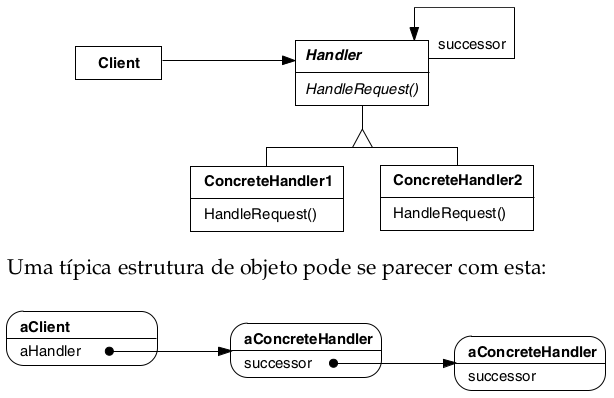

# Chain of Responsibility

## Intenção

Evitar o acoplamento do remetente de uma solicitação ao seu receptor, ao dar a mais de um objeto a oportunidade de
tratar a solicitação. Encadear os objetos receptores, passando a solicitação ao longo da cadeia até que um objeto a
trate.

## Aplicabilidade

- Quando mais de um objeto pode tratar uma solicitação e o objeto que a tratará não conhecido a priori. O objeto que
  trata a solicitação deve ser escolhido automaticamente.
- Quando você quer emitir uma solicitação para um dentre vários objetos, sem especificar explicitamente o receptor.
- Quando o conjunto de objetos que pode tratar uma solicitação deveria ser especificado dinamicamente.

## Estrutura

## Usos conhecidos

- Validação de dados em cadeia
    - **Contexto:** Um campo precisa passar por várias validações encadeadas.
    - **Exemplo real:** Validação de formulário: campo obrigatório → tamanho mínimo → formato válido.
    - **Uso:** Cada validação é um handler que decide se continua ou bloqueia o fluxo.

- Logs com múltiplos níveis
    - **Contexto:** Um sistema de logging que trata diferentes níveis de severidade.
    - **Exemplo real:** Log de DEBUG, INFO, WARN e ERROR em diferentes destinos.
    - **Uso:** O log é enviado para a cadeia e cada handler decide se trata ou passa adiante.

- Processamento de eventos
    - **Contexto:** Eventos disparam múltiplos tipos de ações, dependendo do tipo.
    - **Exemplo real:** Um evento "pedido criado" pode ser tratado por várias camadas: emissão de nota, envio de e-mail,
      analytics.
    - **Uso:** Cada handler trata ou ignora o evento, passando adiante para o próximo.

- Sistemas de permissão/autorização
    - **Contexto:** Verificar permissões baseadas em regras múltiplas e hierárquicas.
    - **Exemplo real:** Usuário tenta acessar um recurso → regra de grupo → regra de perfil → regra global.
    - **Uso:** Cada verificação passa a responsabilidade se não for suficiente.

- Interpretação de comandos ou parsing
    - **Contexto:** Comandos são interpretados por diferentes partes do sistema.
    - **Exemplo real:** Um chatbot processa mensagens: saudações → comandos → fallback.
    - **Uso:** Cada handler tenta processar a entrada, ou delega ao próximo.

## Padrões relacionados

- [Composite](../../structural/composite)
