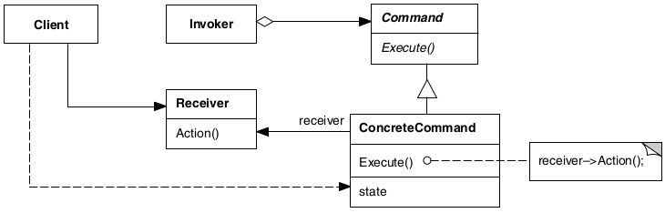

# Command

## Intenção

Encapsular uma solicitação como um objeto, desta forma permitindo parametrizar clientes com diferentes solicitações,
enfileirar ou fazer o registro (log) de solicitações e suportar operações que podem ser desfeitas.

## Aplicabilidade

- Quando você deseja parametrizar objetos por uma ação a ser executada. Você pode expressar tal parametrização numa
  linguagem procedural através de uma função callback.
- Quando você deseja especificar, enfileirar e executar solicitações em tempos diferentes. Um objeto Command pode ter um
  tempo de vida independente da solicitação original. Se o receptor de uma solicitação pode ser representado de uma
  maneira independente do espaço de endereçamento, então você pode transferir um objeto command para a solicitação para
  um processo diferente e lá atender a solicitação.
- Quando você deseja suportar desfazer operações. A operação **Execute**, pode armazenar estados para reverter seus
  efeitos no próprio comando. A interface de Command deve ter acrescentada uma operação **Unexecute**, que reverte os
  efeitos de uma chamada anterior de Execute. Os comandos executados são armazenados em uma lista histórica. O nível
  ilimitado de desfazer e refazer operações é obtido percorrendo esta lista para trás e para frente, chamando operações
  Unexecute e Execute, respectivamente.
- Quando você deseja suportar o registro (logging) de mudanças de maneira que possam ser reaplicadas no caso de uma
  queda de sistema. Ao aumentar a interface de Command com as operações carregar e armazenar, você pode manter um
  registro (log) persistente das mudanças. A recuperação de uma queda de sistema envolve a recarga dos comandos
  registrados a partir do disco e sua reexecução com a operação Execute.
- Quando você deseja estruturar um sistema em torno de operações de alto nível construídas sobre operações primitivas.
  Tal estrutura é comum em sistemas de informação que suportam transações. Uma transação encapsula um conjunto de
  mudanças nos dados. O padrão Command fornece uma maneira de modelar transações. Os Commands têm uma interface comum,
  permitindo invocar todas as transações da mesma maneira. O padrão também facilita estender o sistema com novas
  transações.

## Estrutura

## Usos conhecidos

- **Sistema de desfazer/refazer (Undo/Redo)**
  - **Contexto:** Aplicações que permitem desfazer ações do usuário.
  - **Exemplo real:** Um editor de texto ou um Photoshop com botões de "Desfazer" e "Refazer".
  - **Uso:** Cada ação do usuário é encapsulada em um comando que pode ser executado e desfeito.

- **Filas de tarefas/job queues**
  - **Contexto:** Agendamento e execução assíncrona de tarefas.
  - **Exemplo real:** Um sistema que envia e-mails em background ou processa uploads.
  - **Uso:** Cada tarefa é um comando que pode ser enfileirado e executado separadamente.

- **Botões de interface gráfica**
  - **Contexto:** Associar diferentes comportamentos a botões ou ações de UI.
  - **Exemplo real:** Um botão “Salvar”, “Exportar” ou “Compartilhar” que executa uma ação específica.
  - **Uso:** Cada botão executa um comando diferente, encapsulando a lógica da ação.

- **Sistemas de workflow**
  - **Contexto:** Etapas de processos que precisam ser executadas em sequência e de forma flexível.
  - **Exemplo real:** Aprovação de documentos, pipelines de build/deploy.
  - **Uso:** Cada etapa do processo é implementada como um comando.

## Padrões relacionados

- [Memento](../memento)
- [Composite](../../structural/composite)
- [Prototype](../../creational/prototype)
