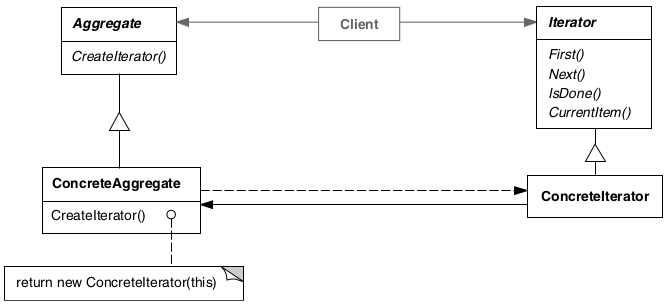

# Iterator

## Intenção

Fornecer um meio de acessar, sequencialmente, os elementos de um objeto agregado sem expor a sua representação
subjacente.

## Aplicabilidade

- Acessar os conteúdos de um objeto agregado sem expor a sua representação interna.
- Suportar múltiplos percursos de objetos agregados.
- Fornecer uma interface uniforme que percorra diferentes estruturas agregadas.

## Estrutura

## Usos conhecidos

- **Percorrer coleções (listas, arrays, mapas, etc.)**
    - **Contexto:** Acesso sequencial a elementos de uma estrutura de dados.
    - **Exemplo real:** `for (item : lista)` no Java, forEach no JavaScript.
    - **Uso:** Iterator encapsula o acesso à estrutura, sem expor sua implementação interna.

- **Paginação de dados**
    - **Contexto:** Exibir resultados por página, carregando sob demanda.
    - **Exemplo real:** Listar produtos em um e-commerce, página por página.
    - **Uso:** Um iterator pode representar a navegação entre páginas, mantendo o estado de onde parou.

- **Leitura de arquivos linha a linha**
    - **Contexto:** Processar arquivos grandes sem carregar tudo na memória.
    - **Exemplo real:** `BufferedReader.readLine()` no Java.
    - **Uso:** Iterator percorre as linhas do arquivo, uma por vez.

- **Acesso a elementos em estruturas personalizadas**
    - **Contexto:** Estruturas como árvores, grafos, ou listas customizadas.
    - **Exemplo real:** Percorrer os nós de uma árvore DOM em HTML.
    - **Uso:** Iterator permite acessar os elementos mesmo sem saber como a estrutura foi implementada.

- **Percorrer coleções compostas (Composite)**
    - **Contexto:** Usado com o padrão Composite para navegar por hierarquias.
    - **Exemplo real:** Navegar por arquivos e pastas em um sistema de arquivos.
    - **Uso:** Cada elemento pode ser um arquivo ou uma pasta com mais elementos, e o iterator resolve a navegação.

- **Interfaces de programação funcional (Streams)**
    - **Contexto:** Operações encadeadas sobre coleções.
    - **Exemplo real:** `Stream.of(...).filter(...).map(...).forEach(...)` no Java ou `array.filter().map().forEach()`
      no JS.
    - **Uso:** Cada operação consome um iterator internamente para processar os dados.

## Padrões relacionados

- [Memento](../memento)
- [Composite](../../structural/composite)
- [Factory Method](../../creational/factorymethod)
