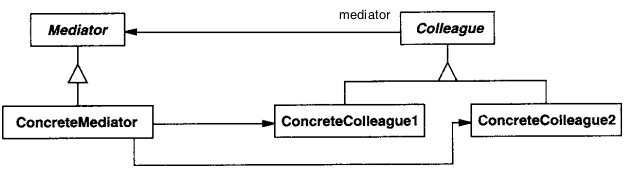

# Mediator

## Intenção

Definir um objeto que encapsula a forma como um conjunto de objetos interage. O Mediator promove o acoplamento fraco ao
evitar que os objetos se refiram uns aos outros explicitamente e permite variar suas interações independentemente.

## Aplicabilidade

- Quando um conjunto de objetos se comunica de maneiras bem-definidas, porém complexas. As interdependências resultantes
  são desestruturadas e difíceis de entender.
- Quando a reutilização de um objeto é difícil porque ele referencia e se comunica com muitos outros objetos.
- Quando um comportamento que está distribuído entre várias classes deveria ser customizável, ou adaptável, sem
  excessiva especialização em subclasses.

## Estrutura

## Usos conhecidos

- **Chat em grupo (sala de bate-papo)**
    - **Contexto:** Vários usuários trocando mensagens em uma sala.
    - **Exemplo real:** Slack, Discord, WhatsApp (versão web).
    - **Uso:** O mediator (sala) recebe mensagens de um usuário e as distribui para os outros. Os usuários não se
      comunicam diretamente.

- **Gerenciamento de módulos ou plugins**
    - **Contexto:** Um sistema com diversos módulos ou extensões que se comunicam.
    - **Exemplo real:** Um editor de texto com plugins para lint, format, autocomplete, etc.
    - **Uso:** O mediator atua como um “dispatcher” entre os módulos, evitando acoplamento direto.

- **Orquestração de microservices**
    - **Contexto:** Microserviços que precisam se coordenar em fluxos de negócio.
    - **Exemplo real:** Em um e-commerce: serviço de pedido → estoque → pagamento → envio.
    - **Uso:** Um serviço central (ex: saga orchestrator, event bus, orchestrator pattern) funciona como Mediator,
      controlando o fluxo.

- **Sistema de notificações**
    - **Contexto:** Diversos eventos ocorrem e notificações precisam ser distribuídas.
    - **Exemplo real:** Em um app de tarefas, ao concluir uma tarefa, notificar o criador, atualizar o painel e logar o
      evento.
    - **Uso:** O Mediator centraliza esse disparo para os interessados sem que a tarefa precise conhecer todos eles.

## Padrões relacionados

- [Façade](../../structural/facade)
- [Observer](../observer)
