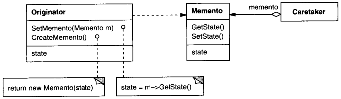

# Memento

## Intenção

Sem violar o encapsulamento, capturar e externalizar um estado interno de um objeto, de maneira que o objeto possa ser
restaurado para esse estado mais tarde.

## Aplicabilidade

- Quando um snapshot de estado de um objeto deve ser salvo de maneira que possa ser restaurado para esse estado mais
  tarde.
- Quando uma interface direta para obtenção do estado exporia detalhes de implementação e romperia o encapsulamento do
  objeto.

## Estrutura

## Usos conhecidos

- **Sistemas de versionamento**
    - **Contexto:** Manter versões anteriores de documentos ou configurações.
    - **Exemplo real:**
        - Google Docs salvando versões anteriores do documento.
        - Git snapshots (commit é um memento do código naquele ponto).
    - **Uso:** Cada versão armazena um estado completo ou incremental que pode ser restaurado.

- **Formulários com rascunho automático**
    - **Contexto:** O sistema salva automaticamente o que o usuário digitou.
    - **Exemplo real:**
        - Gmail salvando rascunhos de e-mails.
        - Formulários da web que preservam os dados em caso de atualização da página.
    - **Uso:** O conteúdo digitado é salvo como snapshot (memento), restaurado quando necessário.

- **Configurações de sistema ou preferências de usuário**
    - **Contexto:** Alterações de configuração com opção de "Cancelar" ou "Restaurar padrão".
    - **Exemplo real:**
        - Painéis de preferências que restauram o estado anterior se o usuário cancelar.
        - Ferramentas como editores de imagem que permitem “Resetar ajustes”.
    - **Uso:** Antes de aplicar mudanças, o sistema salva o estado atual como memento.

- **Aplicações com workflows ou formulários em etapas**
    - **Contexto:** Voltar para uma etapa anterior sem perder os dados preenchidos.
    - **Exemplo real:**
        - Wizards de instalação.
        - Carrinhos de compra com múltiplas etapas.
    - **Uso:** Cada etapa pode armazenar um estado de progresso como memento.

## Padrões relacionados

- [Command](../command)
- [Iterator](../iterator)
