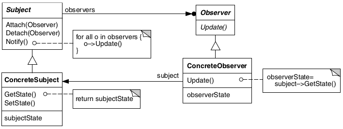

# Observer

## Intenção

Definir uma dependência um-para-muitos entre objetos, de maneira que quando um objeto muda de estado todos os seus
dependentes são notificados e atualizados automaticamente.

## Aplicabilidade

- Quando uma abstração tem dois aspectos, um dependente do outro. Encapsulando esses aspectos em objetos separados,
  permite-se variá-los e reutilizá-los independentemente.
- Quando uma mudança em um objeto exige mudanças em outros, e você não sabe quantos objetos necessitam ser mudados.
- Quando um objeto deveria conseguir notificar outros objetos sem fazer hipóteses, ou usar informações, sobre quem são
  esses objetos. Em outras palavras, você não quer que esses objetos sejam fortemente acoplados.

## Estrutura

## Usos conhecidos

- **Sistemas de notificação**
    - **Contexto:** Um evento ocorre e vários interessados precisam ser avisados.
    - **Exemplo real:**
        - Notificações por e-mail, push ou SMS quando um pedido é feito, alterado ou entregue.
        - Trello ou Jira notificando os membros de um card atualizado.
    - **Uso:** Os "observadores" (usuários, serviços, etc.) se inscrevem e são notificados automaticamente.

- **Bindings entre objetos**
    - **Contexto:** Objetos que precisam se manter sincronizados.
    - **Exemplo real:**
        - Campo de busca que atualiza a lista de resultados dinamicamente.
        - Um select que muda dinamicamente conforme outro select (ex: país → estado).
    - **Uso:** O segundo campo observa o primeiro.

- **Monitoramento e auditoria**
    - **Contexto:** Registrar ou reagir a mudanças no sistema.
    - **Exemplo real:**
        - Logs automáticos de alterações em entidades no banco de dados.
        - Sistemas de auditoria como o Hibernate Envers.
    - **Uso:** Os observers são listeners que reagem a eventos como onUpdate, onDelete.

- **Chats, comentários e feeds em tempo real**
    - **Contexto:** Usuários conectados recebem atualizações simultâneas.
    - **Exemplo real:**
        - Comentários ao vivo em lives.
        - Atualizações de feed em redes sociais.
    - **Uso:** Usuários estão "observando" eventos em tempo real via WebSockets ou listeners.

- **Sistemas baseados em eventos (Event-Driven Architecture)**
    - **Contexto:** Microserviços ou módulos reagem a eventos de outros componentes.
    - **Exemplo real:** Um serviço de pagamento publica um evento "Pagamento Aprovado" → serviços de envio e faturamento
      escutam e reagem.
    - **Uso:** Os serviços interessados são observers de eventos publicados por outros.

## Padrões relacionados

- [Mediator](../mediator)
