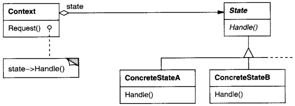

# State

## Intenção

Permite a um objeto alterar seu comportamento quando o seu estado interno muda. O objeto parecerá ter mudado sua classe.

## Aplicabilidade

- Quando o comportamento de um objeto depende do seu estado e ele pode mudar seu comportamento em tempo de execução,
  dependendo desse estado.
- Quando operações têm comandos condicionais grandes, de várias alternativas, que dependem do estado do objeto.

## Estrutura

## Usos conhecidos

- **Formulários com etapas**
    - **Contexto:** Wizard forms com várias etapas que mudam conforme o progresso.
    - **Exemplo real:**
        - Cadastro dividido em “Informações Pessoais” → “Endereço” → “Pagamento”.
        - Checkout de e-commerce que muda conforme o cliente avança.
    - **Uso:** Cada etapa é um estado, com regras e validações próprias.

- **Sistemas de workflow**
    - **Contexto:** Objetos que passam por diferentes fases com regras distintas.
    - **Exemplo real:** Processo de aprovação de um documento: “Rascunho” → “Em Revisão” → “Aprovado” → “Arquivado”.
    - **Uso:** Cada fase é um estado que define comportamentos e transições válidas.

- **Autenticação de usuários**
    - **Contexto:** Comportamento muda dependendo se o usuário está logado ou não.
    - **Exemplo real:** Sistema mostra botões diferentes se o usuário estiver logado ou anônimo.
    - **Uso:** Estado “Autenticado” ou “Anônimo” define as ações permitidas.

- **Editor de texto (modo de edição)**
    - **Contexto:** Modo de interação com diferentes comportamentos.
    - **Exemplo real:** Google Docs com modo "Edição", "Comentário" ou "Visualização".
    - **Uso:** Cada modo altera o comportamento ao interagir com o texto.

## Padrões relacionados

- [Singleton](../../creational/singleton)
- [Flyweight](../../structural/flyweight)
