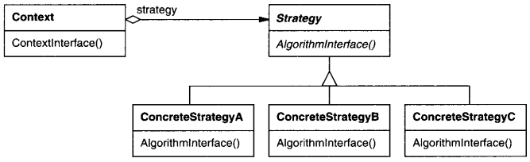

# Strategy

## Intenção

Definir uma família de algoritmos, encapsular cada uma delas e torná-las intercambiáveis. 
Strategy permite que o algoritmo varie independentemente dos clientes que o utilizam.

## Aplicabilidade

- Quando muitas classes relacionadas diferem somente no seu comportamento. As estratégias fornecem uma maneira de 
configurar uma classe com um dentre muitos comportamentos.
- Quando você necessita de variantes de um algoritmo. Por exemplo, pode definir algoritmos que refletem diferentes soluções de 
compromisso entre espaço/tempo. As estratégias podem ser usadas quando essas variantes são implementadas como uma hierarquia 
de classes de algoritmos.
- Quando um algoritmo usa dados dos quais os clientes não deveriam ter conhecimento. Use o padrão Strategy para evitar a 
exposição das estruturas de dados complexas, específicas do algoritmo.
- Quando uma classe define muitos comportamentos, e estes aparecem em suas operações como múltiplos comandos condicionais 
da linguagem. Em vez de usar muitos comandos condicionais, mova os ramos condicionais relacionados para a sua própria classe Strategy.

## Estrutura

## Usos conhecidos

- **Cálculo de frete**
  - **Contexto:** O sistema precisa calcular o valor do frete com base na transportadora ou método de entrega.
  - **Exemplo real:** Correios, Jadlog, entrega expressa, retirada na loja.
  - **Uso:** Cada estratégia implementa uma regra de cálculo diferente. O sistema usa a que for apropriada para o pedido.
- **Meios de pagamento**
  - **Contexto:** O checkout de um e-commerce oferece múltiplas formas de pagamento.
  - **Exemplo real:** Cartão de crédito, boleto, Pix, PayPal.
  - **Uso:** Cada meio de pagamento é uma estratégia com sua lógica específica de processamento.
- **Ordenação com critérios diferentes**
  - **Contexto:** Um sistema precisa ordenar dados de formas diferentes, dependendo da situação.
  - **Exemplo real:** Ordenar uma lista de produtos por preço, popularidade ou avaliação.
  - **Uso:** Cada tipo de ordenação é uma estratégia que pode ser aplicada dinamicamente.
- **Validação de dados**
  - **Contexto:** Diferentes formulários exigem validações específicas.
  - **Exemplo real:** Um CPF precisa ser validado num contexto e um CNPJ em outro.
  - **Uso:** Estratégias de validação aplicadas conforme o tipo de dado/contexto.
- **Compressão de arquivos**
  - **Contexto:** O sistema permite ao usuário escolher o algoritmo de compressão.
  - **Exemplo real:** ZIP, RAR, GZIP.
  - **Uso:** Cada algoritmo é uma estratégia que implementa uma interface comum de compressão.
- **Autenticação com múltiplas estratégias**
  - **Contexto:** Usuários podem se autenticar de diferentes maneiras.
  - **Exemplo real:** Login com senha, autenticação por token, OAuth (Google, Facebook).
  - **Uso:** A estratégia de autenticação é escolhida de acordo com o tipo de login.
- **Aplicação de descontos**
  - **Contexto:** Diferentes regras de desconto podem se aplicar dependendo da promoção.
  - **Exemplo real:** Desconto por valor de compra, por cupom, por fidelidade.
  - **Uso:** Cada regra é uma estratégia, escolhida dinamicamente no carrinho de compras.

## Padrões relacionados

- [Flyweight](../../structural/flyweight)
