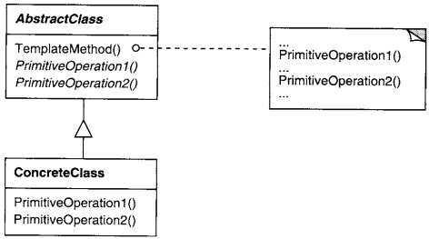

# Template Method

## Intenção

Definir o esqueleto de um algoritmo em uma operação, postergando alguns passos para as subclasses. Template Method
permite que subclasses redefinam certos passos de um algoritmo sem mudar a estrutura do mesmo.

## Aplicabilidade

- Para implementar as partes invariantes de um algoritmo uma só vez e deixar para as subclasses a implementação do
  comportamento que pode variar.
- Quando o comportamento comum entre subclasses deve ser fatorado e concentrado numa classe comum para evitar a
  duplicação de código.
- Para controlar extensões de subclasses. Você pode definir um Template Method que chama operações “gancho” em pontos
  específicos, desta forma permitindo extensões somente nesses pontos.

## Estrutura

## Usos conhecidos

- **Processo de pagamento**
  - **Contexto:** Fluxo de pagamento que pode ter variações, mas segue um processo fixo.
  - **Exemplo real:** Pagamento por cartão de crédito, boleto, PayPal, etc. Todos seguem o mesmo processo básico: validar pagamento → processar → confirmar → notificar.
  - **Uso:** O algoritmo principal é definido, mas cada tipo de pagamento pode personalizar detalhes (validação, confirmação).

- **Relatórios financeiros**
  - **Contexto:** Geração de relatórios financeiros em diferentes formatos.
  - **Exemplo real:** Relatório de vendas, relatórios de despesas: todas seguem um template fixo, mas a forma como os dados são coletados e formatados pode variar.
  - **Uso:** O formato do relatório é o mesmo, mas cada tipo de relatório (vendas, despesas) personaliza detalhes da coleta e cálculo.

- **Processamento de arquivos**
  - **Contexto:** Manipulação de diferentes tipos de arquivos (CSV, XML, JSON) com um fluxo comum.
  - **Exemplo real:** Ler e processar diferentes tipos de arquivos: abrir arquivo → ler conteúdo → processar dados → gerar saída.
  - **Uso:** O processo de leitura e processamento é o mesmo, mas a forma como os dados são lidos ou interpretados varia dependendo do tipo de arquivo.

## Padrões relacionados

- [Factory Method](../../creational/factorymethod)
- [Strategy](../strategy)
