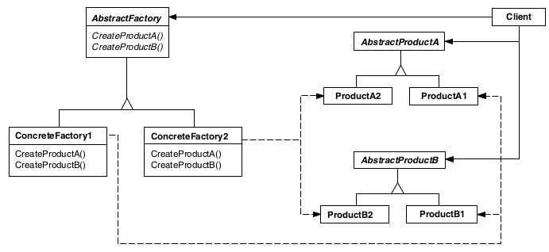

# Abstract Factory

## Intenção

Fornecer uma interface para criação de famílias de objetos relacionados ou dependentes sem especificar suas classes concretas.

## Aplicabilidade

- Quando um sistema deve ser independente de como seus produtos são criados, compostos ou representados.
- Quando um sistema deve ser configurado como um produto de uma família de múltiplos produtos.
- Quando uma família de objetos-produto foi projetada para ser usada em conjunto e você necessita garantir esta restrição. 
- Quando você quer fornecer uma biblioteca de classes de produtos e quer revelar somente suas interfaces, não sua implementações

## Estrutura

## Usos conhecidos

- **Interfaces gráficas com temas (UI)**
    - Imagine que você está desenvolvendo uma aplicação que pode ter diferentes temas (claro, escuro, high contrast). 
  O Abstract Factory permite criar fábricas para cada tema, produzindo botões, checkboxes e menus com estilos específicos, 
  sem mudar o código principal da aplicação.

- **Conexão com múltiplos bancos de dados**
    - Se o sistema precisa se conectar a diferentes bancos (MySQL, PostgreSQL, MongoDB), você pode criar uma fábrica abstrata 
  para cada tipo de banco, e ela forneceria os objetos certos (ex: conexão, comandos, transações) para cada implementação.
- **Configuração de aplicações multi-plataforma**
    - Se você precisa de compatibilidade com múltiplos sistemas operacionais, o Abstract Factory pode criar instâncias 
  específicas para Windows, macOS ou Linux, encapsulando as diferenças de implementação.
- **Comunicação via protocolos diferentes**
    - Se você tem um sistema que precisa se comunicar via HTTP, WebSocket ou TCP, uma fábrica abstrata pode fornecer as 
  implementações corretas, dependendo do protocolo escolhido.

## Padrões relacionados

- [Factory method](../factorymethod)
- [Prototype](../prototype)
- [Singleton](../singleton)