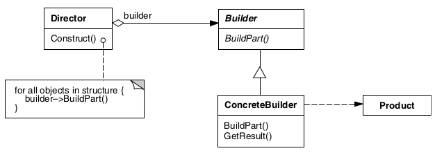

# Builder

## Intenção

Separar a construção de um objeto complexo da sua representação de modo que o mesmo processo de construção possa criar 
diferentes representações.
Ele é especialmente útil quando um objeto tem muitos atributos opcionais ou configurações complexas.

## Aplicabilidade

- Quando o algoritmo para criação de um objeto complexo deve ser independente das partes que compõem o objeto e de como 
elas são montadas.
- Quando o processo de construção deve permitir diferentes representações para o objeto que é construído.

## Estrutura

## Usos conhecidos

- **Objetos com muitos atributos opcionais**
    - Quando um objeto possui muitos campos, nem todos obrigatórios, o Builder evita a criação de múltiplos construtores (Telescoping Constructor).
      - Exemplo: Configurar um pedido de e-commerce com itens opcionais, frete, descontos, etc.

- **Imutabilidade e clareza**
  - Ajuda a construir objetos imutáveis com uma API fluida, facilitando a leitura e a manutenção do código.
      - Exemplo: Configurar um usuário com dados básicos, endereço e preferências de notificação.

- **Separação de responsabilidades**
  - Separa a lógica de construção do objeto da sua representação final, facilitando alterações ou expansões futuras.
      - Exemplo: Construir relatórios diferentes (PDF, CSV, HTML) com a mesma estrutura de dados.

- **Facilidade de leitura e manutenção**
  - O Builder torna o código mais legível, especialmente com cadeias de métodos encadeados.
      - Exemplo: Configurar conexões de banco de dados com parâmetros opcionais.

- **Evolução de classes sem quebrar contratos**
  - Se novas propriedades forem adicionadas, o Builder permite introduzir novos métodos sem afetar o código que já usa a classe.

- **Construção de objetos complexos passo a passo**
    - Permite criar objetos complexos de maneira controlada, com métodos para configurar partes específicas.
        - Exemplo: Montar um carro com diferentes componentes (motor, rodas, pintura, acessórios).

## Padrões relacionados

- [Abstract factory](../abstractfactory)
- [Composite](../../structural/composite)

