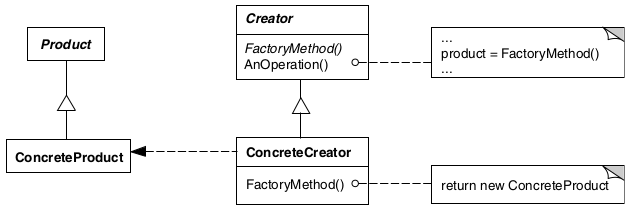

# Factory method

## Intenção

Definir uma interface para criar um objeto, mas deixar as subclasses decidirem que classe instanciar. O Factory Method 
permite adiar a instanciação para subclasses.

## Aplicabilidade

- Quando uma classe não pode antecipar a classe de objetos que deve criar.
- Quando uma classe quer que suas subclasses especifiquem os objetos que criam.
- Quando classes delegam responsabilidade para uma dentre várias subclasses auxiliares e você quer localizar o conhecimento 
de qual subclasse auxiliar que é a delegada.

## Estrutura

## Usos conhecidos

- **Centralizar a criação de objetos complexos**
    - Se a criação de um objeto envolve lógica complexa (como configurar propriedades ou validar dados), o Factory Method 
  encapsula essa lógica em um único lugar, simplificando o uso da classe.
- **Permitir que subclasses determinem a implementação concreta**
    - Se você quer que as subclasses escolham qual classe concreta instanciar, o Factory Method permite essa decisão sem modificar a classe base.
- **Facilidade para testes e injeção de dependência**
    - Ao usar factories, é fácil substituir implementações concretas durante os testes. Isso reduz o acoplamento direto a 
  classes específicas, tornando o código mais testável.
- **Adaptação dinâmica de objetos**
    - Se o tipo de objeto a ser criado depende de alguma configuração ou parâmetro dinâmico, o Factory Method pode encapsular 
  essa lógica de decisão.

## Padrões relacionados

- [Abstract factory](../abstractfactory)
- [Prototype](../prototype)
