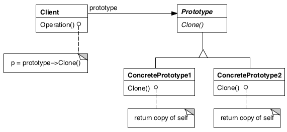

# Prototype

## Intenção

Criar novos objetos a partir de uma instância existente, clonando-a. Isso evita a criação direta 
com o operador `new`, sendo útil quando o custo de criação é alto ou quando a lógica de inicialização é complexa.

## Aplicabilidade

- Quando um sistema tiver que ser independente de como os seus produtos são criados, compostos e representados.
- Quando as classes a instanciar forem especificadas em tempo de execução, por exemplo, por carga dinâmica.
- Para evitar a construção de uma hierarquia de classes de fábricas paralelas à hierarquia de classes de produto.
- Quando as instâncias de uma classe puderem ter uma dentre poucas combinações diferentes de estados. Pode ser mais 
- conveniente instalar um número correspondente de protótipos e cloná-los, ao invés de instanciar a classe
  manualmente, cada vez com um estado apropriado.

## Estrutura

## Usos conhecidos

- **Criação de objetos complexos**
  - Quando um objeto tem muitas configurações iniciais ou depende de recursos caros, cloná-lo é mais eficiente do que recriá-lo do zero.

- **Manter estado inicial**
  - Útil para manter uma configuração padrão. Por exemplo, criar múltiplos usuários com permissões básicas, partindo de um protótipo base.

- **Sistemas de cache**
  - Quando você quer manter um conjunto de objetos prontos para serem reutilizados, clonando-os sob demanda.

- **Desacoplamento de classes concretas**
  - Se você usa o protótipo, o código cliente não precisa conhecer a implementação exata da classe, apenas o método de clonagem.

- **Documentos ou relatórios dinâmicos**
    - Para gerar múltiplas versões de um documento com pequenas variações, sem reconstruir tudo do zero.

## Padrões relacionados

- [Abstract factory](../abstractfactory)
- [Composite](../../structural/composite)
- [Decorator](../../structural/decorator)
