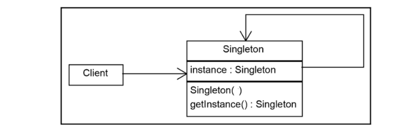

# Singleton

## Intenção

Garantir que uma classe tenha somente uma instância e fornecer o ponto global de acesso para ela.

## Aplicabilidade

- Quando for preciso haver apenas uma instância de uma classe, e essa instância tiver que dar acesso aos clientes 
através de um ponto conhecido.
- Quando a única instância tiver de ser extensível através de subclasses, possibilitando aos clientes usar uma instância 
estendida sem alterar o seu código.  

## Estrutura

## Usos conhecidos

- **Gerenciamento de conexões de banco de dados**
  - Em sistemas que precisam de uma única conexão com o banco de dados durante toda a execução da aplicação, o padrão 
    Singleton é utilizado para garantir que apenas uma instância da conexão seja criada e reutilizada, evitando a 
    sobrecarga de criar novas conexões constantemente.
- **Gerenciamento de configurações**
  - Em muitas aplicações, é necessário carregar configurações globais, como parâmetros de configuração, chaves de API ou 
    informações de configuração do sistema. O Singleton garante que as configurações sejam carregadas uma vez e acessadas 
    de forma centralizada em toda a aplicação.
- **Gerenciamento de logs**
  - O padrão Singleton pode ser utilizado em sistemas de log para garantir que exista apenas uma instância do gerenciador 
  de logs, evitando a criação de múltiplas instâncias do log, o que poderia gerar problemas de concorrência ou desperdício de recursos.
- **Gerenciamento de threads e pool de threads**
  - Em sistemas multithreaded, o Singleton pode ser utilizado para gerenciar o acesso a um pool de threads, garantindo 
  que as threads sejam reutilizadas de maneira eficiente sem que múltiplos pools sejam criados.

## Padrões relacionados

- [Abstract factory](../abstractfactory)
- [Builder](../builder)
- [Prototype](../prototype)

