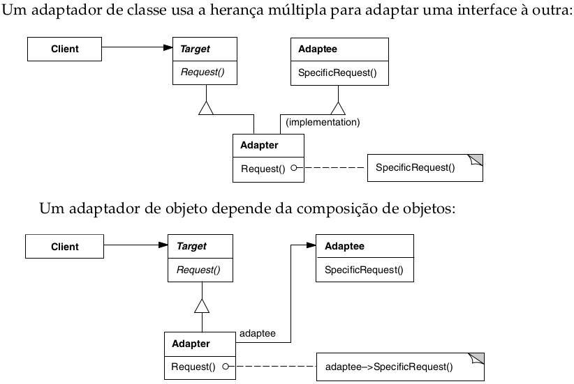

# Adapter

## Intenção

Converter a interface de uma classe em outra interface, esperada pelos clientes.

## Aplicabilidade

- Quando você quiser usar uma classe existente, mas sua interface não corresponder à interface de que necessita.
- Quando você quiser criar uma classe reutilizável que coopere com classes não-relacionadas ou não-previstas, ou seja, classes que não necessariamente tenham interfaces compatíveis.
- Quando você precisar usar várias subclasses existentes, porém, for impraticável adaptar essas interfaces criando subclasses para cada uma.

## Estrutura

## Usos conhecidos

- **Integração com sistemas legados**
    - Quando você está trabalhando com código antigo ou bibliotecas antigas, o Adapter permite adaptar essas APIs para 
  funcionar com seu código novo, sem precisar reescrever o sistema legado.
- **Reutilização de código existente**
    - Você pode reutilizar uma classe existente que não implementa a interface necessária apenas criando um adapter ao redor dela.
- **Padronização de múltiplas APIs diferentes**
    - Quando você tem várias classes com APIs diferentes (ex: APIs de pagamento, serviços de terceiros, etc), você pode 
  criar Adapters para cada uma e expor uma interface comum ao restante do sistema.
- **Facilidade para testes**
    - Ao adaptar interfaces externas para uma interface conhecida e controlada, você facilita a criação de stubs ou 
  mocks em testes automatizados.
- **Trabalhar com bibliotecas externas**
    - Se uma biblioteca de terceiros tem uma interface incompatível com o seu código, o Adapter permite fazer essa 
  ponte sem precisar alterar a biblioteca (que é geralmente fechada para modificação).

## Padrões relacionados

- [Bridge](../bridge)
- [Decorator](../decorator)
- [Proxy](../proxy)
