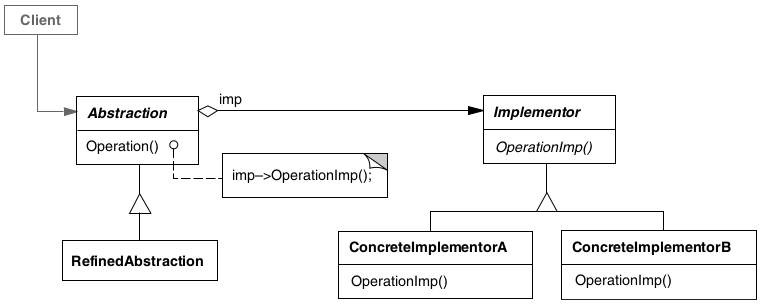

# Bridge

## Intenção

Desacoplar uma abstração da sua implementação, de modo que as duas possam variar independentemente.

## Aplicabilidade

- Quando desejar evitar um vínculo permanente entre uma abstração e sua implementação.
- Quando tanto as abstrações como suas implementações tiverem de ser extensíveis por meio de subclasses.
- Quando mudanças na implementação de uma abstração não puderem ter impacto sobre os clientes.
- Quando você desejar ocultar completamente a implementação de uma abstração dos clientes.
- Quando desejar compartilhar uma implementação entre múltiplos objetos e este fato deve estar oculto do cliente.

## Estrutura

## Usos conhecidos

- **Sistema de Notificações**
    - Você tem diferentes tipos de notificação (Ex: alerta de sistema, boas-vindas, promoção) e quer enviar por 
  diferentes meios de envio (e-mail, SMS, push). O Bridge entra pra separar o que é "o que mandar" de "como mandar".
- **Geração de Relatórios**
  - Seu sistema gera relatórios (ex: Vendas, Estoque, Clientes) e o formato pode variar (PDF, Excel, CSV).
  Ao invés de misturar tudo, o Bridge separa a abstração (tipo de relatório) da implementação (formato).

## Padrões relacionados

- [Abstract Factory](../../creational/abstractfactory)
- [Adapter](../adapter)
