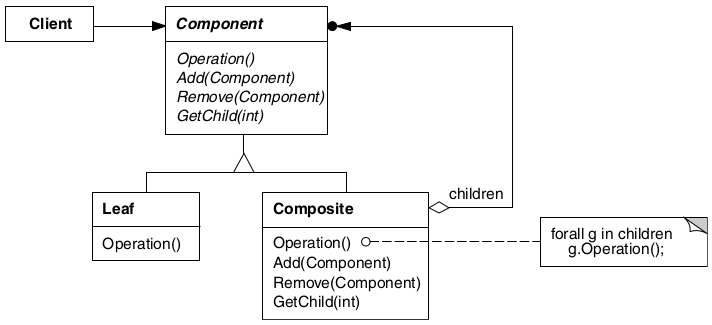

# Composite

## Intenção

Compor objetos em estruturas de árvore para representarem hierarquias partes-todo.
Composite permite aos clientes tratarem de maneira uniforme objetos individuais e
composições de objetos.

## Aplicabilidade

- Quando quiser representar hierarquias partes-todo de objetos.
- Quando quiser que os clientes consigam ignorar a diferença entre composições de objetos e objetos individuais. 
Os clientes tratarão todos os objetos na estrutura composta de maneira uniforme.

## Estrutura

## Usos conhecidos

- **Sistema de Arquivos**
  - Diretórios contêm arquivos ou outros diretórios.

- **Menus em Sistemas Web ou Desktop**
  - Um menu pode conter itens simples ou submenus.

- **Organograma de Funcionários**
  - Um gerente pode ter subordinados que também são gerentes ou funcionários comuns.

- **Formulários Dinâmicos**
  - Campos simples (input, checkbox) e compostos (grupos de campos, seções) coexistem.

- **Produtos em E-commerce**
  - Um produto pode ser simples ou um kit com vários produtos.

- **Layout de Telas**
  - Um layout pode conter componentes simples (botão, texto) ou outros layouts (grid, row).

- **Permissões e Grupos de Acesso**
  - Uma permissão pode ser individual ou um grupo de permissões.

## Padrões relacionados

- [Decorator](../decorator)
- [Flyweight](../flyweight)
- [Iterator](../../behavioral/iterator)

