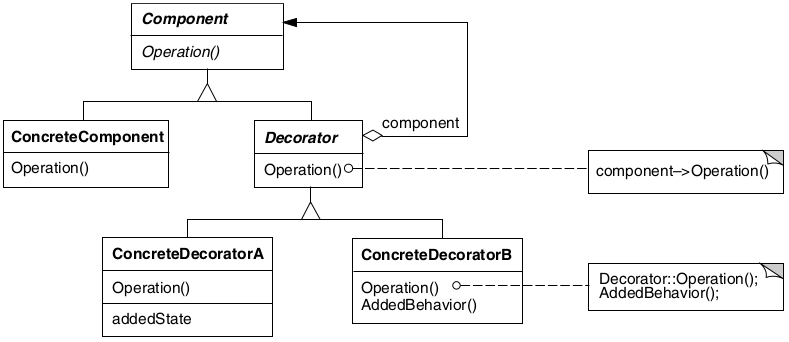

# Decorator

## Intenção

Dinamicamente, agregar responsabilidades adicionais a um objeto. Os Decorators fornecem uma alternativa flexível ao uso de subclasses para extensão de funcionalidades.

## Aplicabilidade

- Para acrescentar responsabilidades a objetos individuais de forma dinâmica e transparente, ou seja, sem afetar outros objetos.
- Para responsabilidades que podem ser removidas.
- Quando a extensão através do uso de subclasses não é prática. Às vezes, um grande número de extensões independentes 
é possível e isso poderia produzir uma explosão de subclasses para suportar cada combinação.

## Estrutura

## Usos conhecidos

- **Adição de Comportamentos em Objetos**
  - **Contexto:** Em jogos, um personagem pode ganhar buffs temporários (ex: +força, +velocidade).
  - **Uso:** Cada buff decora o personagem com um novo comportamento ou atributo.

- **Logger com Formatação e Contexto**
  - **Contexto:** Um logger pode adicionar timestamps, nome da thread, cor do texto etc.
  - **Uso:** Decorators adicionam detalhes à mensagem antes de logar.

- **Criptografia e Compressão**
  - **Contexto:** Dados podem ser comprimidos, depois criptografados (ou vice-versa).
  - **Uso:** Cada operação decora a anterior, mantendo a interface de escrita.

- **Validação de Campos**
  - **Contexto:** Um campo pode ter múltiplas validações (ex: obrigatório, tamanho, regex).
  - **Uso:** Cada validador adiciona uma camada extra de verificação.

## Padrões relacionados

- [Adapter](../adapter)
- [Composite](../composite)
- [Strategy](../../behavioral/strategy)

