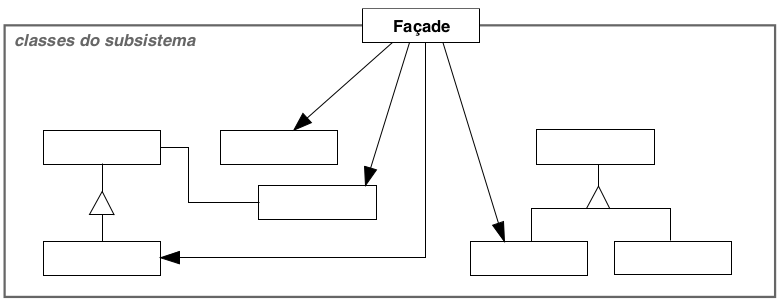

# Façade

## Intenção

Fornecer uma interface unificada para um conjunto de interfaces em um subsistema. Façade define uma interface de nível mais alto que torna o subsistema mais fácil de
ser usado.

## Aplicabilidade

- Quando você desejar fornecer uma interface simples para um subsistema complexo.
- Quando existirem muitas dependências entre clientes e classes de implementação de uma abstração.
- Quando você desejar estruturar seus subsistemas em camadas.

## Estrutura

## Usos conhecidos

- **APIs Simplificadas para Sistemas Complexos**
  - **Contexto:** Um sistema com múltiplos módulos internos pode ser difícil de integrar diretamente.
  - **Uso:** O façade expõe métodos como gerarFatura() ou pagarConta(), simplificando a interface para o consumidor externo.

- **Clientes REST em sistemas backend**
  - **Contexto:** Integrações com APIs externas costumam envolver múltiplas etapas, headers, autenticação, tratamento de erros etc.
  - **Uso:** Quem usa só precisa chamar buscarDadosUsuario(token) e não se preocupa com o resto.

- **Camada de Serviço no Spring (Service Layer)**
  - **Contexto:** A camada de serviço geralmente atua como façade da camada de domínio ou repositórios.
  - **Uso:** O controller só chama pedidoService.realizarPedido() sem saber os detalhes.

- **Sistemas Legados**
  - **Contexto:** Integrações com sistemas antigos podem ter APIs difíceis, mal documentadas ou inconsistentes.
  - **Uso:** Isola a complexidade e protege o sistema principal contra mudanças no legado.

- **Bibliotecas de Terceiros**
  - **Contexto:** Muitas bibliotecas possuem APIs extensas e difíceis de usar diretamente.
  - **Uso:** Oferece métodos simples como redimensionarImagem() ou converterParaCinza().

## Padrões relacionados

- [Abstract Factory](../../creational/abstractfactory)
- [Singleton](../../creational/singleton)
- [Mediator](../../behavioral/mediator)
