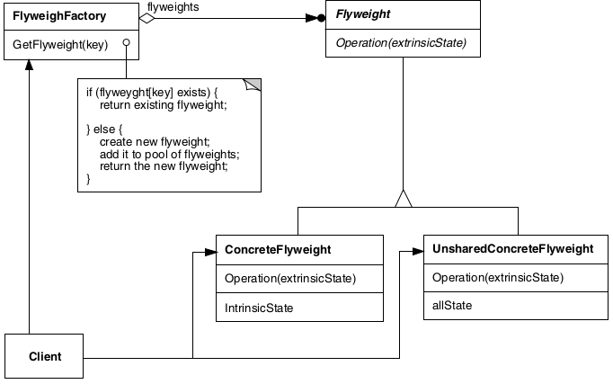

# Flyweight

## Intenção

Usar compartilhamento para suportar eficientemente grandes quantidades de objetos de granularidade fina.

## Aplicabilidade
A eficiência do padrão Flyweight depende muito de como e onde ele é usado. Aplique o padrão Flyweight quando 
todas as condições a seguir forem verdadeiras:

- Uma aplicação utiliza um grande número de objetos.
- Os custos de armazenamento são altos por causa da grande quantidade de objetos.
- A maioria dos estados de objetos pode ser tornada extrínseca.
- Muitos grupos de objetos podem ser substituídos por relativamente poucos objetos compartilhados, uma vez que estados extrínsecos são removidos.
- A aplicação não depende da identidade dos objetos. Uma vez que objetos Flyweights podem ser compartilhados, testes de identidade produzirão o
  valor verdadeiro para objetos conceitualmente distintos.

## Estrutura

## Usos conhecidos

- **Sistemas de mapas**
  - Contexto: Elementos como estradas, ícones de locais e rótulos se repetem em diferentes regiões.
  - Uso: Compartilha os dados comuns entre os marcadores do mapa.
- **Renderização de gráficos e jogos**
  - Contexto: Jogos têm muitos objetos visuais repetidos, como árvores, inimigos, balas etc.
  - Uso: O objeto Flyweight guarda os dados compartilháveis (imagem), e o restante (posição, vida) fica fora.
- **Ícones e Emojis em sistemas de chat**
  - Contexto: Um emoji pode aparecer milhares de vezes nas conversas.
  - Uso: A imagem é armazenada uma vez, e todas as instâncias usam a mesma referência.
- **Geradores de relatórios com dados repetidos**
  - Contexto: Relatórios com milhares de linhas contendo os mesmos tipos de dados.
  - Uso: Em vez de repetir esses dados em cada linha, compartilha-se a instância do objeto.

## Padrões relacionados

- [Composite](../composite)
- [State](../../behavioral/state)
- [Strategy](../../behavioral/strategy)
