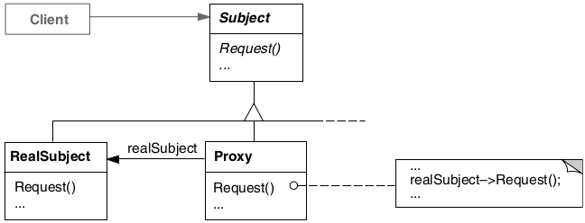

# Proxy

## Intenção

Fornece um substituto (surrogate) ou marcador da localização de outro objeto para controlar o acesso a esse objeto.

## Aplicabilidade

- Quando um remote proxy fornece um representante local para um objeto num espaço de endereçamento diferente.
- Quando um virtual proxy cria objetos caros sob demanda.
- Quando um protection proxy controla o acesso ao objeto original. Os proxies de proteção são úteis quando os objetos 
devem ter diferentes direitos de acesso.

## Estrutura

## Usos conhecidos

- **Proxy Virtual (Carregamento sob demanda / Lazy loading)**
  - **Contexto:** Criar objetos pesados apenas quando forem realmente usados.
  - **Exemplo real:** Um sistema de galeria de imagens carrega miniaturas, mas só carrega a imagem em alta resolução quando o usuário clica nela.
  - **Uso:** O Proxy controla o acesso ao objeto real e instancia sob demanda.

- **Proxy Remoto (acesso a recursos remotos)**
  - **Contexto:** Acessar objetos que estão em outra máquina ou servidor como se estivessem localmente.
  - **Exemplo real:** Um sistema cliente acessa um serviço de banco de dados remoto via RMI, gRPC ou SOAP.
  - **Uso:** O proxy lida com a comunicação de rede, serialização, etc., escondendo isso do cliente.

- **Proxy de Segurança (controle de acesso)**
  - **Contexto:** Restringir o acesso a certos métodos com base em permissões.
  - **Exemplo real:** Um painel administrativo só permite que usuários com permissão "admin" alterem configurações críticas.
  - **Uso:** O proxy verifica as permissões antes de delegar a chamada para o objeto real.

- **Proxy de Cache (melhoria de performance)**
  - **Contexto:** Armazenar em cache resultados de chamadas caras ou demoradas.
  - **Exemplo real:** Um serviço que acessa dados de uma API externa pode guardar o resultado em cache local por alguns minutos.
  - **Uso:** O proxy retorna o valor em cache se disponível, evitando chamadas desnecessárias.

- **Proxy de Registro (log, auditoria, profiling)**
  - **Contexto:** Registrar chamadas a métodos para rastreamento ou depuração.
  - **Exemplo real:** Um sistema que registra logs de todas as operações feitas por um usuário.
  - **Uso:** O proxy intercepta a chamada, faz o log e depois chama o método real.

- **ORMs (ex: Hibernate)**
  - **Contexto:** Entidades associadas são carregadas sob demanda (lazy loading).
  - **Exemplo real:** Uma entidade Pedido pode ter uma lista de Produtos, que só são carregados do banco quando acessados.
  - **Uso:** O Hibernate usa proxies para representar relações até que elas sejam acessadas.

- **Browsers e proxies de rede**
  - **Contexto:** Proxies HTTP/HTTPS para roteamento de tráfego, segurança e cache.
  - **Exemplo real:** Um proxy corporativo que filtra sites ou armazena conteúdo acessado com frequência.
  - **Uso:** O browser se comunica com o proxy, que decide se repassa ou intercepta a requisição.

- **Proxy em APIs (ex: API Gateway)**
  - **Contexto:** Uma única porta de entrada para várias APIs.
  - **Exemplo real:** O API Gateway da AWS que recebe requisições e redireciona para diferentes serviços.
  - **Uso:** Ele atua como um proxy entre o cliente e os microsserviços, aplicando segurança, cache, throttling etc

## Padrões relacionados

- [Adapter](../adapter)
- [Decorator](../decorator)
